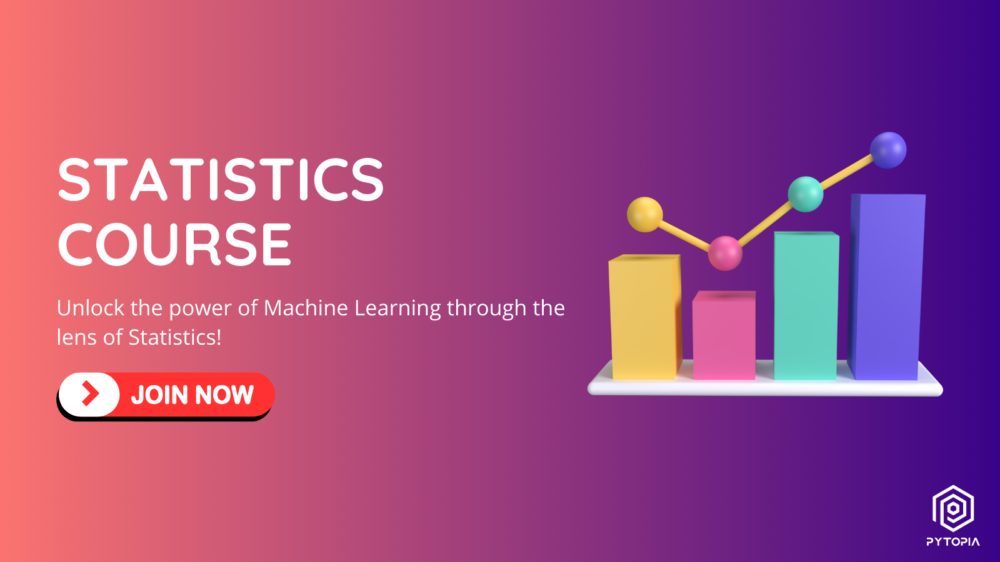

[](https://www.pytopia.ai)
[](https://t.me/pytopia_ai)
[](https://instagram.com/pytopia.ai)
[](https://www.youtube.com/@pytopia)
[](https://linkedin.com/company/pytopia)
[](https://twitter.com/pytopia_ai)

Welcome to the Statistics for Machine Learning course repository! This course is specifically designed to provide you with a solid foundation in statistical concepts and techniques that are essential for success in the field of Machine Learning. Whether you're a beginner in Machine Learning or an experienced practitioner looking to strengthen your statistical knowledge, this course has something to offer.

## 🎯 Course Objectives

By the end of this course, you will:

- Understand the fundamental concepts and principles of statistics
- Learn how to apply statistical techniques to real-world Machine Learning problems
- Gain proficiency in descriptive and inferential statistics
- Master hypothesis testing and estimation methods
- Acquire hands-on experience in conducting various types of t-tests
- Discover the relevance and importance of statistics in Machine Learning

## 📚 Course Contents

The course is divided into the following chapters:

1. Introduction
2. Descriptive Statistics
3. Inferential Statistics
4. Hypothesis Testing
5. Estimation
6. t Test For One Sample
7. t Test for Two Independent Samples
8. t Test for Two Related Samples

Each chapter includes a combination of theoretical explanations, practical examples, and hands-on exercises to reinforce your understanding of the concepts and their applications in Machine Learning.

## ✅ Prerequisites

To get the most out of this course, you should have:

- Basic knowledge of mathematics (algebra and calculus)
- Familiarity with programming (preferably in Python)
- Enthusiasm to learn and explore the fascinating intersection of statistics and Machine Learning!

# 📚 Learn with Us!
We also offer a [course on these contents](https://www.pytopia.ai/courses/statistics) where learners can interact with peers and instructors, ask questions, and participate in online coding sessions. By registering for the course, you also gain access to our dedicated Telegram group where you can connect with other learners and share your progress. Enroll now and start learning! Here are some useful links:

- [Statistics Course](https://www.pytopia.ai/courses/statistics)
- [Pytopia Public Telegram Group](https://t.me/pytopia_ai)
- [Pytopia Website](https://www.pytopia.ai/)

[](https://www.pytopia.ai/courses/statistics)

## 🚀 Getting Started

To get started with the course, follow these steps:

1. Clone this repository to your local machine using the following command:
   ```
   git clone https://github.com/your-username/statistics-for-ml-course.git
   ```

2. Navigate to the cloned repository:
   ```
   cd statistics-for-ml-course
   ```

3. Set up the required dependencies and environment by following the instructions in the `setup.md` file.

4. Start exploring the course materials, beginning with the first chapter.

Throughout the course, you will discover how statistical concepts and techniques are applied in various stages of the Machine Learning pipeline, from data preprocessing and feature selection to model evaluation and hyperparameter tuning. By the end of this course, you will have a strong grasp of the statistical foundations necessary to excel in Machine Learning and tackle real-world problems with confidence.

# 📞 Contact Information

Feel free to reach out to us!

- 🌐 Website: [pytopia.ia](https://www.pytopia.ai)
- 💬 Telegram: [pytopia_ai](https://t.me/pytopia_ai)
- 🎥 YouTube: [pytopia](https://www.youtube.com/c/pytopia)
- 📸 Instagram: [pytopia.ai](https://www.instagram.com/pytopia.ai)
- 🎓 LinkedIn: [pytopia](https://www.linkedin.com/in/pytopia)
- 🐦 Twitter: [pytopia_ai](https://twitter.com/pytopia_ai)
- 📧 Email: [pytopia.ai@gmail.com](mailto:pytopia.ai@gmail.com)
